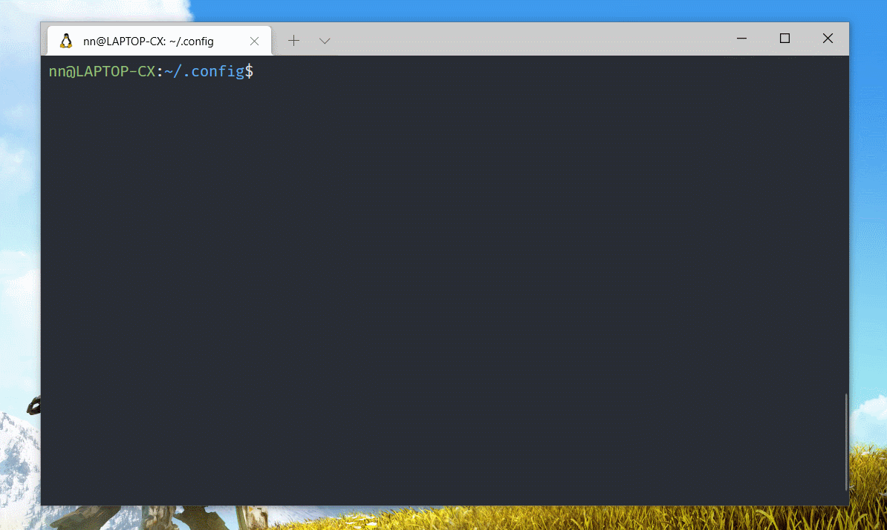

# learn-neovim-lua

运行效果

正在写。。

## language server

`:h lsp`

- https://github.com/typescript-language-server/typescript-language-server
- https://github.com/neovim/nvim-lspconfig/blob/master/CONFIG.md

`yarn global add vscode-langservers-extracte`

## emmet

https://www.npmjs.com/package/ls_emmet

## Vsnip

:VsnipOpen
