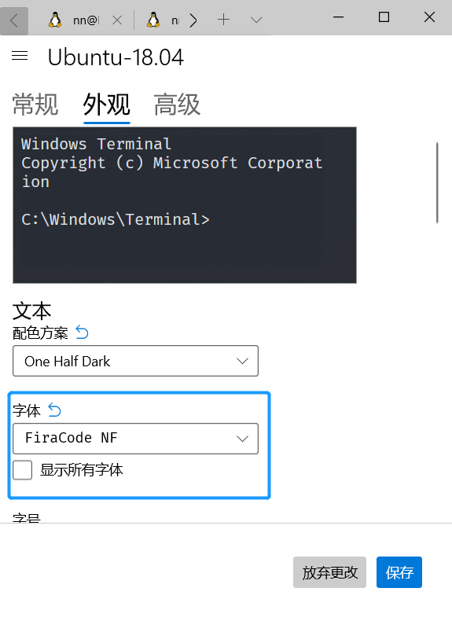

# learn-neovim-lua

本人常年在 `Windows` 机器上做 `Web` 开发，虽然已经使用 “`VIM`” 好多年了，但都是在使用 [VSCodeVim](https://github.com/VSCodeVim/Vim)

可以说我的 `VIM` 指法都是在 `VSCode` 上练会的。 中间曾尝试配置过几次原生的 `VIM`，包括各种 GUI 的版本，最终都放弃了。

主要原因当然是 `VSCode` 实在是太强大了，应用商店有各种插件，涵盖 Web 开发的方方面面，装上基本不用配置就非常非常好用了。
早期 `VSCode` 上的有好几个 vim 相关的插件，各有各的 bug。但后期 [VSCodeVim](https://github.com/VSCodeVim/Vim) 被收编后就统一了，
有了微软的投入也变的足够好用了。最主要的是，我可以混用 `VIM` 的快捷键和 `VSCode` 的原生功能，比如 `Ctrl+p` `Ctrl+Shift+p` 等。

而 `VIM` 这边太原始，配置太硬核了，要在 `vimrc` 里写一堆看不懂的配置才能满足基本使用。费大劲配置出来效果还也不如 `VSCode`。
除了在服务器上开发，在本地根本没有任何优势。

但状况随着时间的推移有了新变化，随着 [WSL 2](https://docs.microsoft.com/en-us/windows/wsl/) 和 [Windows Terminal](https://www.microsoft.com/zh-cn/p/windows-terminal)
的推出，Windows 命令行也有了 Unicode、和 UTF-8 字符支持，GPU 加速文本渲染引擎等支持。

而 [Neovim](https://github.com/neovim/neovim) 0.5.x 正式版推出后，内置了 LSP（稍后介绍），
`Lua` 成了编辑器的一等语言，众多 `VIM` 插件都有了 `Lua` 原生版本，配置也没有那么硬核了，突然使得 `Vim` 更加现代化了，也更好用了。

反而 `VSCode` 这边不断的加我用不到的功能，感觉越来越慢了，最烦的是 VSCode 并不能完全的脱离鼠标，总有不得不用鼠标去点的按钮。

所以我又一次尝试了逃离 `VSCode`，使用下来，目前感觉良好，常用的功能都没问题，而且可以完全脱离鼠标了。

本文介绍一下我如何在 `Windows` 命令行环境下配置 `Neovim`，以及各种常用插件的配置和使用方法。

先看运行效果


## WSL 2

首先确定你的 `Windows` 系统是否为 `WSL 2`，如果不是请先找教程升级到 `WSL2`

查看方法为在 `cmd` 中运行 `wls -l -v`


可以看到我安装的子系统为 `Ubuntu-18.04`，后边的 `VERSION` 2 表示是在 `WSL2` 环境，继续。

## Windows Terminal

在 [微软应用商店](https://www.microsoft.com/en-us/p/windows-terminal/9n0dx20hk701?activetab=pivot:overviewtab#) 直接点击 Get 安装


安装后可以在 `设置` 里进行一系列美化设置，之后最重要的是安装 `Nerd fonts`。

## Nerd fonts

简单讲，Nerd fonts 就是打包了各种常见的 ‘iconic fonts’，到你常用的字体里。

这样就可以方便的在命令行下显示这些 icons 了。 很多插件都会用到这些图标


到这里 https://www.nerdfonts.com/font-downloads 找到你喜欢的字体。

比如我最常用的是 `Fira Code` 字体，我安装这个

https://github.com/ryanoasis/nerd-fonts/tree/master/patched-fonts/FiraCode/Regular/complete/

注意要下载兼容 `Windows` 的版本 `XXXX Windows Compatible.ttf`



到 `设置` `外观` 里，选中刚才安装的字体，保存。

安装过后，命令行里就支持显示这些小图标了，到这个网址可以复制小图标

https://www.nerdfonts.com/cheat-sheet

到命令行里粘贴。


## 安装 Neovim

由于我的环境的 `Ubuntu-18.04` ，所以要用 `apt` 安装 `Neovim`，具体方法如下：

```bash
sudo add-aptrepository ppa:neovim-ppa/stable
sudo apt-get update
sudo apt-get install neovim
```

### 配置文件位置

Neovim 配置文件不是 `.vimrc`

而是

`~/.config/nvim/init.vim`

## 插件管理器 Packer

https://github.com/wbthomason/packer.nvim

```bash

return require('packer').startup(function()
  -- Packer can manage itself
  use 'wbthomason/packer.nvim'
end)

```

## 语法高亮 Treesitter

https://github.com/nvim-treesitter/nvim-treesitter/wiki/Installation

:PackerSync

~/.config/nvim/lua/plugnis/init.Lua

```bash

return require('packer').startup(function()
  -- Packer can manage itself
  use 'wbthomason/packer.nvim'
  -- If you are using Packer
  use 'shaunsingh/nord.nvim'
  use { 'nvim-treesitter/nvim-treesitter', run = ':TSUpdate' }
end)

```

## nerd font 字体

https://github.com/ryanoasis/nerd-fonts/tree/master/patched-fonts/FiraCode

## language server

`:h lsp`

- https://github.com/typescript-language-server/typescript-language-server
- https://github.com/neovim/nvim-lspconfig/blob/master/CONFIG.md

`yarn global add vscode-langservers-extracte`

## emmet

https://www.npmjs.com/package/ls_emmet

## Vsnip

:VsnipOpen

## rust

先安装 language server， 手动安装

https://rust-analyzer.github.io/

```bash
git clone https://github.com/rust-analyzer/rust-analyzer.git
cd rust-analyzer
cargo xtask install --server
```

如果提示错误，先升级 `cargo`

```
rustup update stable
```

安装成功

```bash
rust-analyzer --version
```

有输出证明安装成功

111
