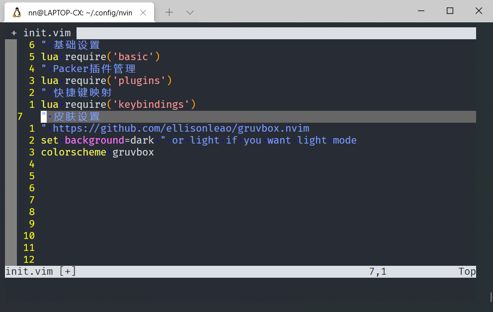
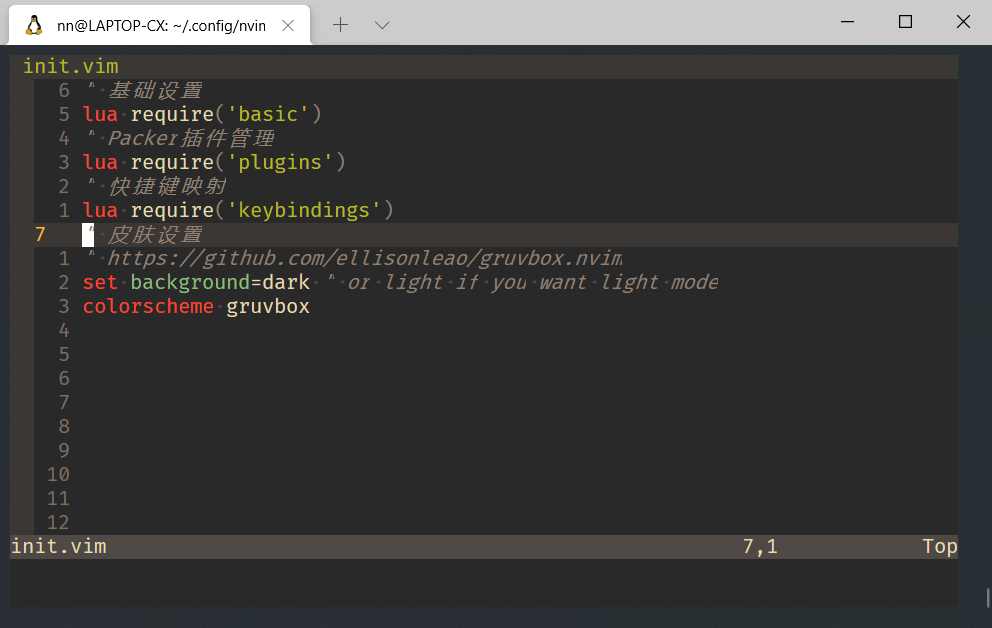
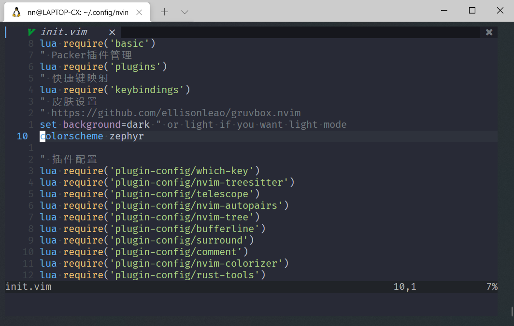

## Neovim 主题配置

本章介绍如何给 `Neovim` 安装主题和配置主题。

主题与一般插件一样，都是用 [上一章](./packer-usage.md) 讲的 `Packer.nvim` 来安装的。

由于后边需要安装 `nvim-treesitter` 语法高亮，所选的主题必须在 [支持 nvim-treesitter 的主题列表](https://github.com/nvim-treesitter/nvim-treesitter/wiki/Colorschemes) 里边找。

目前我在使用的主题是 `gruvbox.nvim` 推荐使用。

## 主题配色安装

打开 [gruvbox.nvim](https://github.com/ellisonleao/gruvbox.nvim) 主页会看到安装方式，其他皮肤也类似

打开 `lua/plugins.lua` ，增加 `gruvbox theme` 相关的代码

```lua
return require('packer').startup(function()
    -- Packer can manage itself
    use 'wbthomason/packer.nvim'
    -- gruvbox theme
    use {
        "ellisonleao/gruvbox.nvim",
        requires = {"rktjmp/lush.nvim"}
    }
end)
```

`:wq` 保存退出，重新打开后运行 `:PackerSync`

如果网络畅通的话，会显示 `Everything already up to date!` 表示安装成功。

打开 `init.vim`，增加

```vim
set background=dark
colorscheme gruvbox
```

保存前：



保存退出，重新打开后：



## nord.nvim 配色

再尝试一个 [nord.nvim](https://github.com/shaunsingh/nord.nvim)

修改 `lua/plugins.lua`

```lua
return require('packer').startup(function()
    -- Packer can manage itself
    use 'wbthomason/packer.nvim'
    -- gruvbox theme
    use {
        "ellisonleao/gruvbox.nvim",
        requires = {"rktjmp/lush.nvim"}
    }
    -- nord theme
    use 'shaunsingh/nord.nvim'
end)
```

`:wq` 保存退出，重新打开后运行 `:PackerSync`

安装成功后，修改 `init.vim`

```vim
set background=dark
colorscheme nord
```

重开后的效果


## zephyr-nvim 配色

再增加一个 [zephyr-nvim](https://github.com/glepnir/zephyr-nvim) 配色

修改 `lua/plugins.lua` 增加

```lua
use 'glepnir/zephyr-nvim'
```

`:wq` 保存退出，重新打开后运行 `:PackerSync`

安装成功后，修改 `init.vim`

```vim
set background=dark
colorscheme zephyr
```



本章结束，如果你有更漂亮的皮肤推荐，欢迎留言告诉我。

下一章开始会介绍一些常用的插件。

- 下一章： [Neovim 插件 nvim-tree 的安装与配置](./plugins/nvim-tree.md)

- [回首页](../README.md)
