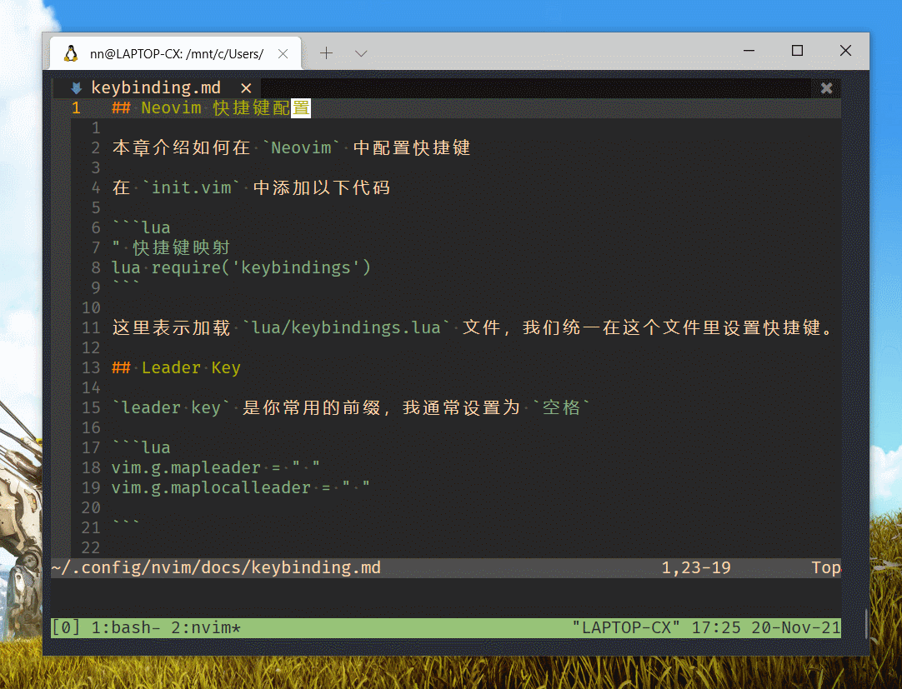
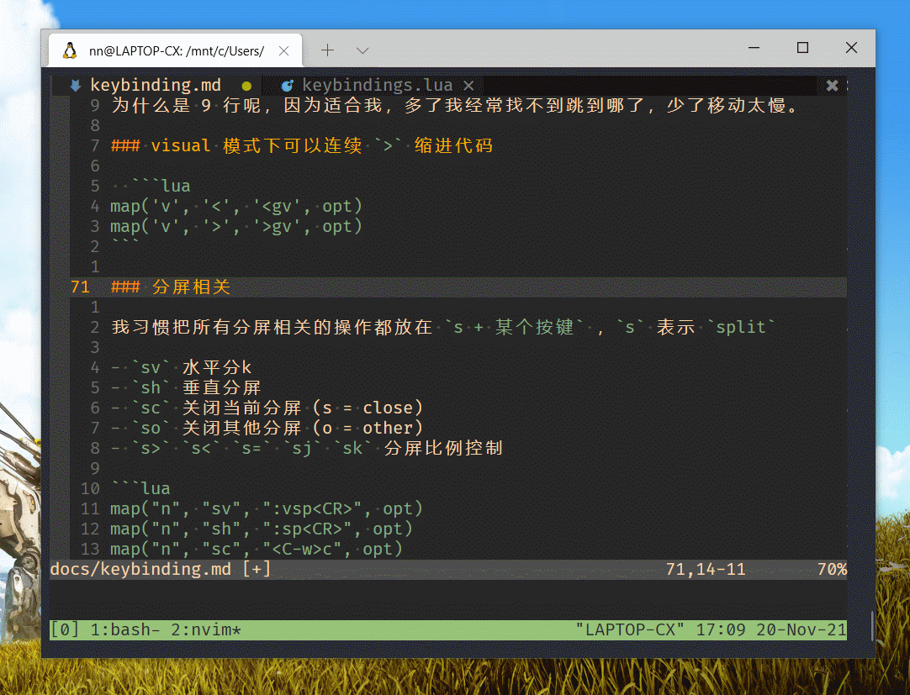

## Neovim 快捷键配置

本章介绍如何在 `Neovim` 中配置快捷键

在 `init.vim` 中添加以下代码

```lua
" 快捷键映射
lua require('keybindings')
```

这里表示加载 `lua/keybindings.lua` 文件，我们统一在这个文件里设置快捷键。

## Leader Key

`leader key` 是你常用的前缀，我通常设置为 `空格`

```lua
vim.g.mapleader = " "
vim.g.maplocalleader = " "

```

后边定义快捷键看到 `<leader>` 就表示 `空格`

## 如何设置快捷键

```lua
vim.api.nvim_set_keymap()
```

`Neovim` 使用上边的指令设置快捷键，[详细信息见这里](https://github.com/nanotee/nvim-lua-guide#defining-mappings)。

```lua
-- 保存本地变量
local map = vim.api.nvim_set_keymap
local opt = {noremap = true, silent = true }

-- 之后就可以这样映射按键了
-- map('模式','按键','映射为XX',opt)
```

## 常用快捷键

`normal` 模式本身就是快捷键模式，而在这里定义的相当于是 **快捷键的快捷键** ， 所以一定是非常常用的按键组合， 或者是通过某个键调用某些命令。

因人而异，我用的快捷键不多，介绍一下，抛砖引玉，你有什么常用的快捷键欢迎留言告诉我。

### 浏览代码

浏览代码的时候，我最常用 `ctrl + u` / `ctrl + d` 移动光标滚动代码，
`u` 和 `p` 表示 `up翻页` 和 `down翻页`。

`j` / `k` 移动太慢， `ctrl + u` / `ctrl + d` 默认移动半屏，翻太快，一不留神就不知道翻到哪了

我喜欢把 `ctrl + u` / `ctrl + d` 设置成移动 9 行，演示：



```lua
map("n", "<C-u>", "9k", opt)
map("n", "<C-d>", "9j", opt)
```

为什么是 9 行呢，因为刚好适合我，尤其是命令行全屏的时候，多了我经常找不到跳到哪了，少了移动太慢。

### visual 模式下可以连续 `>` 缩进代码

第一个参数 `v` 表示 visual 模式

```lua
map('v', '<', '<gv', opt)
map('v', '>', '>gv', opt)
```

### 分屏相关

我习惯把所有分屏相关的操作都放在 `s + 某个按键` ，`s` 表示 `split`。

`alt + hjkl` 在窗口之间跳转。 演示：



- `sv` 水平分屏
- `sh` 垂直分屏
- `sc` 关闭当前分屏 (c = close)
- `so` 关闭其他分屏 (o = other)
- `s>` `s<` `s=` `sj` `sk` 分屏比例控制

```lua
map("n", "sv", ":vsp<CR>", opt)
map("n", "sh", ":sp<CR>", opt)
map("n", "sc", "<C-w>c", opt)
map("n", "so", "<C-w>o", opt) -- close others

-- 比例控制（不常用，因为支持鼠标拖拽）
map("n", "s.", ":vertical resize +20<CR>", opt)
map("n", "s,", ":vertical resize -20<CR>", opt)
map("n", "s=", "<C-w>=", opt)
map("n", "sj", ":resize +10<CR>",opt)
map("n", "sk", ":resize -10<CR>",opt)

```

我使用 `alt + hjkl` 在窗口之间跳转

```lua
map("n", "<A-h>", "<C-w>h", opt)
map("n", "<A-j>", "<C-w>j", opt)
map("n", "<A-k>", "<C-w>k", opt)
map("n", "<A-l>", "<C-w>l", opt)

```

水平分屏很常用，比如 `svgd` 命令相当于 打开右侧窗口进入方法的定义，看完可以随手 `sc` 关闭掉。

**本文到此结束了**，下边还有给插件的快捷键，可以大概看一下，装插件的时候再细说。

```lua
--插件快捷键

-- Telescope
map("n", "<C-p>", ":Telescope find_files<CR>", opt)
map("n", "<leader>f", ":Telescope find_files<CR>", opt)
map("n", "<leader>g", ":Telescope live_grep<CR>", opt)

-- nvimTree
map('n', '<C-n>', ':NvimTreeToggle<CR>', opt)

-- bufferline 左右切换
map("n", "<C-h>", ":BufferLineCyclePrev<CR>", opt)
map("n", "<C-l>", ":BufferLineCycleNext<CR>", opt)


pluginKeys = {}

-- 代码注释插件
-- see ./lua/plugin-config/comment.lua
pluginKeys.comment = {
  -- normal 模式
  toggler = {
    line = '<leader>c',
    block = '<leader>bc',
  },
  -- visual 模式
  opleader = {
    -- ctrl + /
    line = '<C-_>',
    block = 'bc',
  },
}

-- lsp 快捷键设置
-- ./lua/lsp/language_servers.lua
pluginKeys.lsp_on_attach = function(client, buffer)
    local function buf_set_keymap(...) vim.api.nvim_buf_set_keymap(bufnr, ...) end
    local function buf_set_option(...) vim.api.nvim_buf_set_option(bufnr, ...) end
    --- Mappings.
    local opts = { noremap=true, silent=true }
    buf_set_keymap('n', 'gD', '<cmd>lua vim.lsp.buf.declaration()<CR>', opts)
    buf_set_keymap('n', 'gd', '<cmd>lua vim.lsp.buf.definition()<CR>', opts)
    buf_set_keymap('n', 'gh', '<cmd>lua vim.lsp.buf.hover()<CR>', opts)
    -- buf_set_keymap('n', 'gi', '<cmd>lua vim.lsp.buf.implementation()<CR>', opts)
    buf_set_keymap('n', 'gr', '<cmd>lua vim.lsp.buf.references()<CR>', opts)
    buf_set_keymap('n', '<F2>', '<cmd>lua vim.lsp.buf.rename()<CR>', opts)
    buf_set_keymap('n', 'ge' , '<cmd>lua vim.lsp.diagnostic.goto_next()<CR>', opts)
    buf_set_keymap('n', 'gpe', '<cmd>lua vim.lsp.diagnostic.goto_prev()<CR>', opts)
    buf_set_keymap('n', '<leader>f', '<cmd>lua vim.lsp.buf.formatting()<CR>', opts)
    buf_set_keymap('n', '<leader>ca', '<cmd>lua vim.lsp.buf.code_action()<CR>', opts)
end

return pluginKeys
```

也可以先看一下完整文件。

- [keybindings.lua 完整文件](../lua/keybindings.lua)

下一章会介绍插件安装，和使用。

- 下一章： [Neovim 插件管理与配置](./packer-usage.md)
- [回首页](../README.md)
