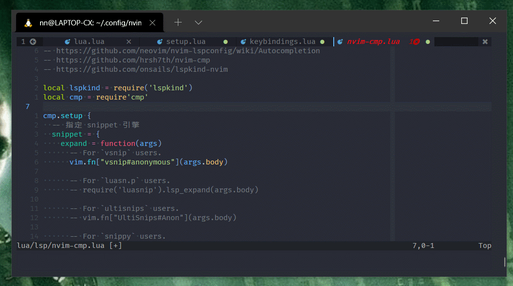
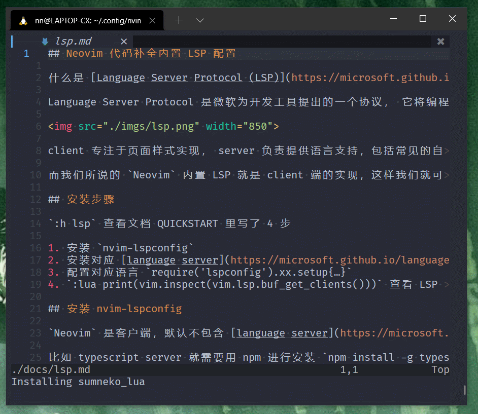
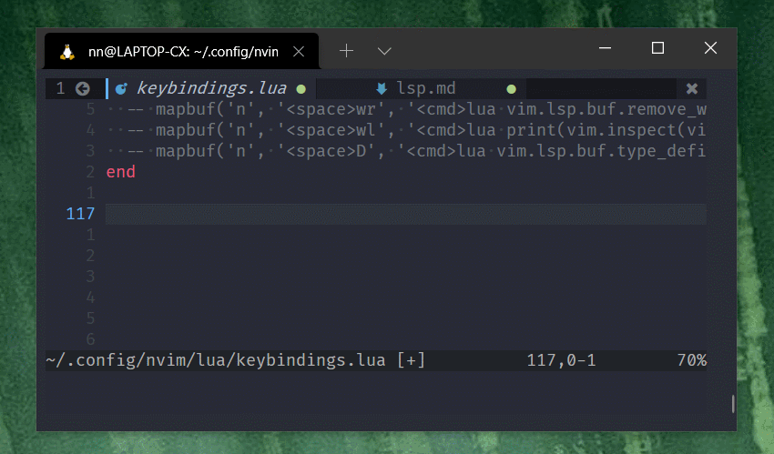
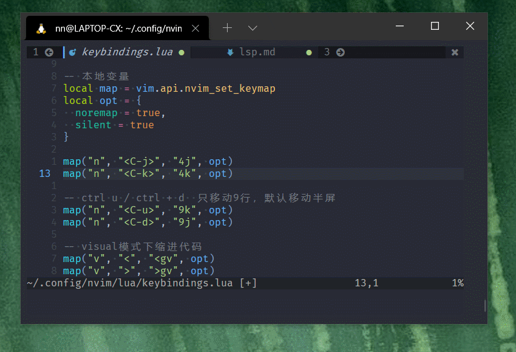
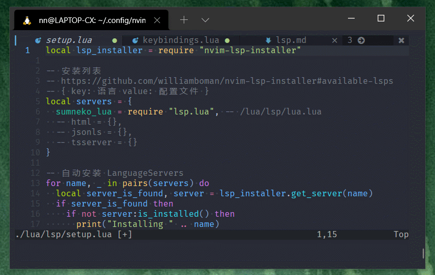

## Neovim 内置 LSP 配置 (一)：基础配置

目前为止最复杂的配置，但最终效果非常酷，值得一配。



什么是 Language Server Protocol ?

[Language Server Protocol (LSP)](https://microsoft.github.io/language-server-protocol/) 是微软为开发工具提出的一个协议， 它将编程工具解耦成了`Language Server` 与 `Language Client` 两部分。


Client 专注于页面样式实现， Server 负责提供语言支持，包括常见的自动补全，跳转到定义，查找引用，悬停文档提示等功能。

而我们所说的 `Neovim` 内置 LSP 就是 client 端的实现，这样我们就可以链接到和 `VSCode` 相同的 language servers ，实现高质量的语法补全。

## 安装步骤

`:h lsp` 查看文档 QUICKSTART 里写了 4 步

1. 安装 `nvim-lspconfig`
2. 安装对应 [language server](https://microsoft.github.io/language-server-protocol/implementors/servers/)
3. 配置对应语言 `require('lspconfig').xx.setup{…}`
4. `:lua print(vim.inspect(vim.lsp.buf_get_clients()))` 查看 LSP 连接状态

## 安装 nvim-lspconfig

`Neovim` 是客户端，默认不包含 [language server](https://microsoft.github.io/language-server-protocol/implementors/servers/)，需要自己安装。

比如 typescript server 就需要用 npm 进行安装 `npm install -g typescript-language-server`

庆幸的是现在有了 [nvim-lsp-installer](https://github.com/williamboman/nvim-lsp-installer#available-lsps) 项目，可以帮助我们自动安装 Language server。

一并装起来，打开 `lua/plugins.lua` 添加 `nvim-lspconfig` 和 `nvim-lsp-installer`

```lua
  -- lspconfig
  use {'neovim/nvim-lspconfig', 'williamboman/nvim-lsp-installer'}
```

`:wq` 保存退出，重新打开后运行 `:PackerSync`

## 安装 Language Server

创建 `lua/lsp/setup.lua` ，保存以下内容，安装 language servers，并配置，下边讲解

```lua
local lsp_installer = require "nvim-lsp-installer"

-- 安装列表
-- https://github.com/williamboman/nvim-lsp-installer#available-lsps
-- { key: 语言 value: 配置文件 }
local servers = {
  sumneko_lua = require "lsp.lua", -- /lua/lsp/lua.lua
}

-- 自动安装 LanguageServers
for name, _ in pairs(servers) do
  local server_is_found, server = lsp_installer.get_server(name)
  if server_is_found then
    if not server:is_installed() then
      print("Installing " .. name)
      server:install()
    end
  end
end
```

`init.vim` 中加载此文件

```vimL
lua require('lsp/setup')
```

还要先创建一个 `lua/lsp/lua.lua` 的空lua server配置文件，后边再填。

`:wq` 保存重启，下方显示 `Installing sumneko_lua` 表示自动安装。

稍等片刻运行 `:LspInstallInfo` 安装成功如图



## 配置 Lua

上边 `lua/lsp/setup.lua` 配置文件中定义了 `servers` 变量

```lua
local servers = {
  sumneko_lua = require "lsp.lua", -- /lua/lsp/lua.lua
}
```

`Lua` 代码和 `JS` 差不多，上述代码定义了一个 table （也叫 object，map，或 dictionary），

key 为 `sumneko_lua`，value 为 `lua/lsp/lua.lua` 文件内容

Lua server 的 key 必须 `sumneko_lua` 才能正确安装。

因为 `sumneko_lua` 这个名字是在[这里查询](https://github.com/williamboman/nvim-lsp-installer#available-lsps) 的。

我打算把每个语言单独配置，本章先配置 Lua, 毕竟我们的配置文件就是 Lua 的。 `require "lsp.lua"` 表示加载 `lua/lsp/lua.lua`

创建对应的配置文件 `lua/lsp/lua.lua`

```lua
local runtime_path = vim.split(package.path, ';')
table.insert(runtime_path, "lua/?.lua")
table.insert(runtime_path, "lua/?/init.lua")
return {
  settings = {
    Lua = {
      runtime = {
        -- Tell the language server which version of Lua you're using (most likely LuaJIT in the case of Neovim)
        version = 'LuaJIT',
        -- Setup your lua path
        path = runtime_path,
      },
      diagnostics = {
        -- Get the language server to recognize the `vim` global
        globals = {'vim'},
      },
      workspace = {
        -- Make the server aware of Neovim runtime files
        library = vim.api.nvim_get_runtime_file("", true),
      },
      -- Do not send telemetry data containing a randomized but unique identifier
      telemetry = {
        enable = false
      },
    },
  },
}

```

每个 Server 都有不同的参数可配置，Lua 的配置说明在 [这里](https://github.com/neovim/nvim-lspconfig/blob/master/doc/server_configurations.md#sumneko_lua)

## 快捷键绑定

回去修改 `lua/lsp/setup.lua`，增加下边部分，当 server 准备好的时候，把配置传进去，并绑定快捷键

```lua
lsp_installer.on_server_ready(function(server)
  local opts = servers[server.name]
  if opts then
    opts.on_attach = function(_, bufnr)
      local function buf_set_keymap(...) vim.api.nvim_buf_set_keymap(bufnr, ...) end
      -- local function buf_set_option(...) vim.api.nvim_buf_set_option(bufnr, ...) end
      -- 绑定快捷键
      require('keybindings').maplsp(buf_set_keymap)
    end
    opts.flags = {
      debounce_text_changes = 150,
    }
    server:setup(opts)
  end
end)
```

由于我要把快捷键配置都放在一个文件里，所以上边配置文件中调用了 `lua/keybindings.lua` 的 maplsp 方法，用于配置 lsp 相关的快捷键

```lua
-- 绑定快捷键
require('keybindings').maplsp(buf_set_keymap)
```

打开 `lua/keybindings.lua` 添加 `maplsp` 方法

根据你的习惯修改，这是我目前的配置，可能未来会有修改

大部分都是 `g` 开头，表示 go XX

```lua
local pluginKeys = {}

-- lsp 回调函数快捷键设置
pluginKeys.maplsp = function(mapbuf)
  -- rename
  mapbuf('n', '<leader>rn', '<cmd>lua vim.lsp.buf.rename()<CR>', opt)
  -- code action
  mapbuf('n', '<space>ca', '<cmd>lua vim.lsp.buf.code_action()<CR>', opt)
  -- go xx
  mapbuf('n', 'gd', '<cmd>lua vim.lsp.buf.definition()<CR>', opt)
  mapbuf('n', 'gh', '<cmd>lua vim.lsp.buf.hover()<CR>', opt)
  mapbuf('n', 'gD', '<cmd>lua vim.lsp.buf.declaration()<CR>', opt)
  mapbuf('n', 'gi', '<cmd>lua vim.lsp.buf.implementation()<CR>', opt)
  mapbuf('n', 'gr', '<cmd>lua vim.lsp.buf.references()<CR>', opt)
  -- diagnostic
  mapbuf('n', 'go', '<cmd>lua vim.diagnostic.open_float()<CR>', opt)
  mapbuf('n', 'gp', '<cmd>lua vim.diagnostic.goto_prev()<CR>', opt)
  mapbuf('n', 'gn', '<cmd>lua vim.diagnostic.goto_next()<CR>', opt)
  -- mapbuf('n', '<leader>q', '<cmd>lua vim.diagnostic.setloclist()<CR>', opt)
  -- leader + =
  mapbuf('n', '<leader>=', '<cmd>lua vim.lsp.buf.formatting()<CR>', opt)
  -- mapbuf('n', '<C-k>', '<cmd>lua vim.lsp.buf.signature_help()<CR>', opt)
  -- mapbuf('n', '<space>wa', '<cmd>lua vim.lsp.buf.add_workspace_folder()<CR>', opt)
  -- mapbuf('n', '<space>wr', '<cmd>lua vim.lsp.buf.remove_workspace_folder()<CR>', opt)
  -- mapbuf('n', '<space>wl', '<cmd>lua print(vim.inspect(vim.lsp.buf.list_workspace_folders()))<CR>', opt)
  -- mapbuf('n', '<space>D', '<cmd>lua vim.lsp.buf.type_definition()<CR>', opt)
end

return pluginKeys
```

注意，这里是通用的设置，并不是所有的 Language Server 都实现了上述所有功能。

比如我发现 Lua Server 就不支持变量改名`vim.lsp.buf.rename()`等。

但最常用的 `gd` 跳转到定义， 然后 `gh` 显示提示等，确定是可用的，见演示。

## 功能演示

`:wq` 重启后，LSP 就应该可以正常使用了。 随便敲代码提示错误



`gd` 跳转到定义

在 `opt` 或 `map` 上点击 `gd` 会跳转到定义该变量的地方



`gh` 显示提示 （go hover）



但是还没有本章开头动图里的 **自动补全代码提示** ，下一章再来配置。 如果配置中有问题欢迎留言指出，谢谢关注。 

- [Neovim 内置 LSP 配置 (二)：自动代码补全](./lsp2.md)  
- [回首页](../README.md)
