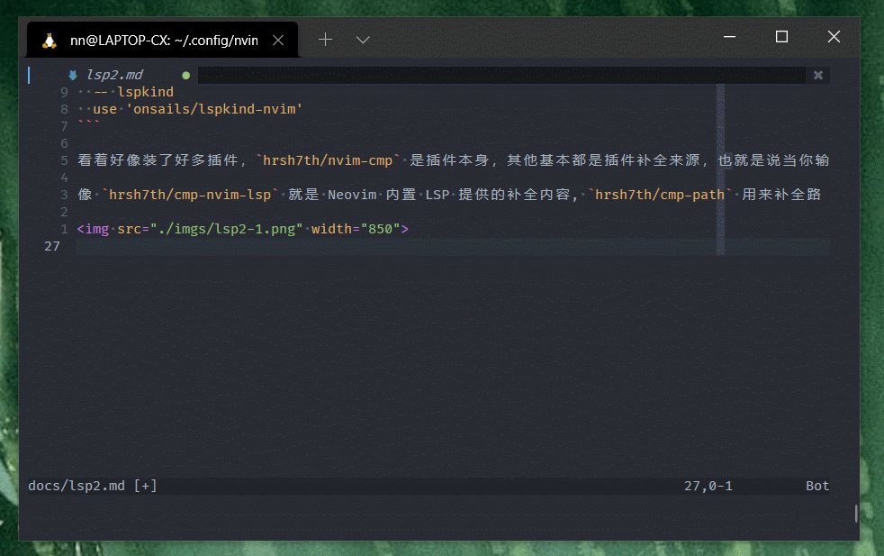

## Neovim 内置 LSP 配置 (二)：自动代码补全

Neovim 本身不支持代码补全，需要通过插件实现，我这里使用最流行的 [nvim-cmp](https://github.com/hrsh7th/nvim-cmp)

## 补全插件安装

打开 `lua/plugins.lua` 添加 `cmp` 相关插件

```lua
  -- nvim-cmp
  use 'hrsh7th/cmp-nvim-lsp' -- { name = nvim_lsp }
  use 'hrsh7th/cmp-buffer'   -- { name = 'buffer' },
  use 'hrsh7th/cmp-path'     -- { name = 'path' }
  use 'hrsh7th/cmp-cmdline'  -- { name = 'cmdline' }
  use 'hrsh7th/nvim-cmp'
  -- vsnip
  use 'hrsh7th/cmp-vsnip'    -- { name = 'vsnip' }
  use 'hrsh7th/vim-vsnip'
  use 'rafamadriz/friendly-snippets'
  -- lspkind
  use 'onsails/lspkind-nvim'
```

看着好像装了好多插件，只有 `hrsh7th/nvim-cmp` 是插件本身，其他`cmp-xxx` 基本都是插件补全来源，也就是说当你输入一个变量的时候，可以从多个来源显示补全的内容。

像 `hrsh7th/cmp-nvim-lsp` 就是 Neovim 内置 LSP 提供的补全内容,

`hrsh7th/cmp-path` 则是用来补全路径，如果配置了这个，当输入一个路径的时候会补全路径，如图



`hrsh7th/vim-vsnip` 被称作一个 snippet 引擎，就是自定义代码段，文档中提到 4 种，都是支持的

snippet engine

- vsnip
- luasnip
- ultisnips
- snippy

我这里选择了 vsnip ，是默认的，貌似很强大，支持 `VSCode` 相同代码格式。

`rafamadriz/friendly-snippets` 非常强大包含了大部分常用语言的代码段，可以到他的 github 主页查看详细内容。

`onsails/lspkind-nvim` 是在代码提示中，显示分类的小图标支持。

不多说 `:wq` 重启，`:PackerSync` 安装

## 代码补全配置

打开 `init.vim` 输入

```vimL
lua require('lsp/nvim-cmp')
```

创建对应的 `lua/lsp/nvim-cmp.lua` 文件

```lua

local lspkind = require('lspkind')
local cmp = require'cmp'

cmp.setup {
  -- 指定 snippet 引擎
  snippet = {
    expand = function(args)
      -- For `vsnip` users.
      vim.fn["vsnip#anonymous"](args.body)

      -- For `luasnip` users.
      -- require('luasnip').lsp_expand(args.body)

      -- For `ultisnips` users.
      -- vim.fn["UltiSnips#Anon"](args.body)

      -- For `snippy` users.
      -- require'snippy'.expand_snippet(args.body)
    end,
  },
  -- 来源
  sources = cmp.config.sources({
    { name = 'nvim_lsp' },
    -- For vsnip users.
    { name = 'vsnip' },
    -- For luasnip users.
    -- { name = 'luasnip' },
    --For ultisnips users.
    -- { name = 'ultisnips' },
    -- -- For snippy users.
    -- { name = 'snippy' },
  }, { { name = 'buffer' },
       { name = 'path' }
    }),

  -- 快捷键
  mapping = require'keybindings'.cmp(cmp),
  -- 使用lspkind-nvim显示类型图标
  formatting = {
    format = lspkind.cmp_format({
      with_text = true, -- do not show text alongside icons
      maxwidth = 50, -- prevent the popup from showing more than provided characters (e.g 50 will not show more than 50 characters)
      before = function (entry, vim_item)
        -- Source 显示提示来源
        vim_item.menu = "["..string.upper(entry.source.name).."]"
        return vim_item
      end
    })
  },
}

-- Use buffer source for `/`.
cmp.setup.cmdline('/', {
  sources = {
    { name = 'buffer' }
  }
})

-- Use cmdline & path source for ':'.
cmp.setup.cmdline(':', {
  sources = cmp.config.sources({
    { name = 'path' }
  }, {
      { name = 'cmdline' }
    })
})
```

上述配置主要包含 3 个部分

- 指定引擎 `vsnip`
- 配置之前安装的补全来源
- 调用 `keybindings.lua` 的`cmp()`方法配置补全弹窗的快捷键

## 快捷键配置

打开 `lua/keybindings.lua` 配置快捷键，增加：

```lua
-- nvim-cmp 自动补全
pluginKeys.cmp = function(cmp)
  return {
    -- 上一个
    ['<C-k>'] = cmp.mapping.select_prev_item(),
    -- 下一个
    ['<C-j>'] = cmp.mapping.select_next_item(),
    -- 出现补全
    ['<A-.>'] = cmp.mapping(cmp.mapping.complete(), { 'i', 'c' }),
    -- 取消
    ['<A-,>'] = cmp.mapping({
      i = cmp.mapping.abort(),
      c = cmp.mapping.close(),
    }),
    -- 确认
    -- Accept currently selected item. If none selected, `select` first item.
    -- Set `select` to `false` to only confirm explicitly selected items.
    ['<CR>'] = cmp.mapping.confirm({
      select = true ,
      behavior = cmp.ConfirmBehavior.Replace
    }),
    -- ['<C-y>'] = cmp.config.disable, -- Specify `cmp.config.disable` if you want to remove the default `<C-y>` mapping.
    ['<C-u>'] = cmp.mapping(cmp.mapping.scroll_docs(-4), { 'i', 'c' }),
    ['<C-d>'] = cmp.mapping(cmp.mapping.scroll_docs(4), { 'i', 'c' }),
  }
end
```

根据你的需要修改。 如果没有问题的话，应该全部完成可以使用了。


下一章介绍一些 LSP 的 UI 美化

有任何问题，欢迎留言指出，非常感谢。

- 下一章： 编写中。
- [回首页](../README.md)
