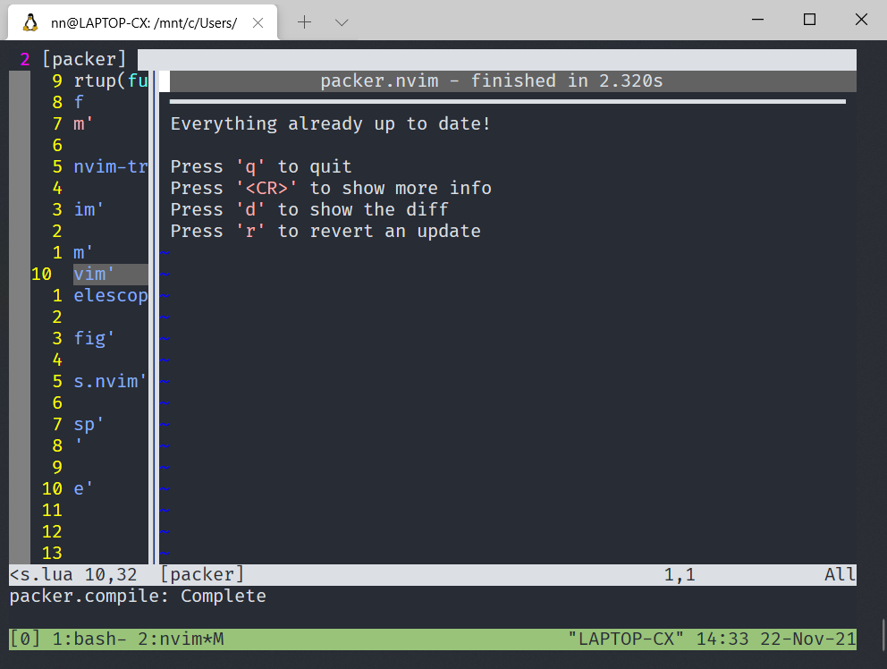

## Neovim 插件管理与配置

本章介绍如何使用 `Packer.nvim` 安装与更新 `Neovim` 插件

## Packer 介绍

之前 `vim` 最常见的插件管理应该是 [vim-plug](https://github.com/junegunn/vim-plug) 我也用过，但 `Neovim` 0.5 以后一般都会推荐使用 `lua` 原生的 [packer.nvim](https://github.com/wbthomason/packer.nvim) 做插件管理 。

一个好插件管理器，最重要是常用插件都支持。 现在 `Neovim` 常用插件的主页上都有如何用 `Packer.nvim` 安装的说明了，所以不用担心。

切换也并不复杂，使用方法上也都差不多，开始安装吧

## 安装 Packer.nvim 插件管理器

按照官网的说明

```bash
git clone --depth 1 https://github.com/wbthomason/packer.nvim\
 ~/.local/share/nvim/site/pack/packer/start/packer.nvim

```

然后创建插件配置文件 `lua/plugins.lua` ，Packer 可以管理和升级他自己

修改 `lua/plugins.lua` 为如下代码

```bash
return require('packer').startup(function()
  -- Packer can manage itself
  use 'wbthomason/packer.nvim'
end)
```

`:wq` 保存退出

修改 `init.vim` ，加载这个文件

```vimL
" Packer插件管理
lua require('plugins')
```

`:wq` 保存退出

## 插件安装与更新

Packer.nvim 安装后会增加以下命令，

```lua
-- Regenerate compiled loader file
:PackerCompile

-- Remove any disabled or unused plugins
:PackerClean

-- Clean, then install missing plugins
:PackerInstall

-- Clean, then update and install plugins
:PackerUpdate

-- Perform `PackerUpdate` and then `PackerCompile`
:PackerSync

-- Loads opt plugin immediately
:PackerLoad completion-nvim ale
```

但通常无论 **安装** 还是 **更新** 插件，我只需要下边这一条命令就够了。

`:PackerSync`

每次修改完 `lua/plugins.lua` 这个文件后，保存退出，重新打开

调用 `:PackerSync` 就可以了，但要确定你的网络可以连接到 `github`。

安装完成， 按 `q` 退出



实在有点丑，下一章我们先把主题装上试试。

- 下一章：[Neovim 主题配置](./colorscheme.md)
- [回首页](../README.md)
