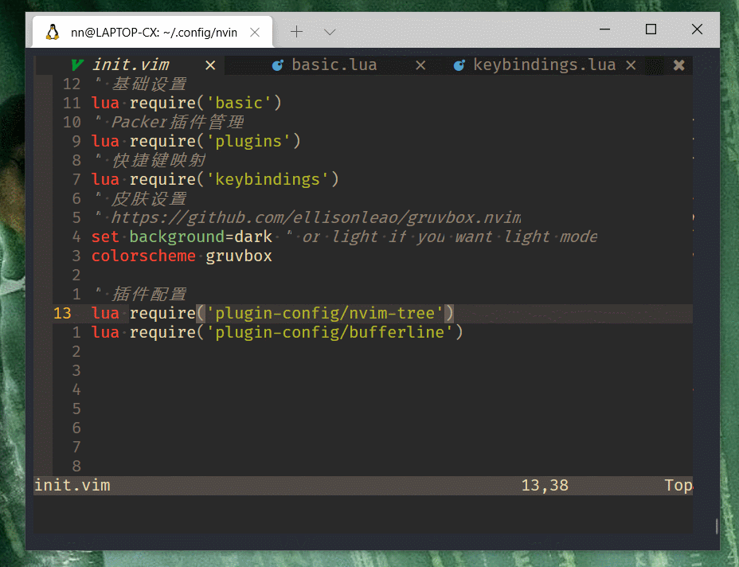
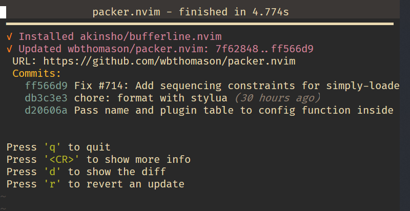
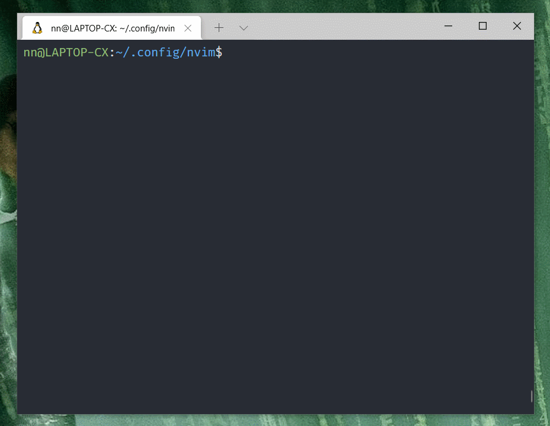

## Neovim 插件 bufferline 的安装与配置

本章介绍如何给 nvim 安装和配置 [bufferline](https://github.com/akinsho/bufferline.nvim) 插件。

`bufferline` 就是把 buffer 显示成类似 `VSCode` 中 Tab 页的形式，如下动图所示：

常用 `VSCode` 的一定非常熟悉这个，我的目标也是尽量接近 `VSCode` 的样子。



## 安装 bufferline.nvim

打开 `plugins.lua` ，增加 `nvim-tree` 相关的代码

```lua
-- bufferline
use {'akinsho/bufferline.nvim', requires = 'kyazdani42/nvim-web-devicons'}
```

完整 `plugins.lua` 文件如下：

```lua
return require('packer').startup(function()
    -- Packer can manage itself
    use 'wbthomason/packer.nvim'
    -- gruvbox theme
    use {
        "ellisonleao/gruvbox.nvim",
        requires = {"rktjmp/lush.nvim"}
    }
    -- nvim-tree
    use {
        'kyazdani42/nvim-tree.lua',
        requires = 'kyazdani42/nvim-web-devicons'
    }
    -- bufferline (新增)
    use {'akinsho/bufferline.nvim', requires = 'kyazdani42/nvim-web-devicons'}
end)

```

`:wq` 保存退出，重新打开后运行 `:PackerSync`

`Packer.nvim` 使用方式参看 [之前章节](../packer-usage.md)

成功后如图所示，按 q 退出



如果报错网络错误，重新运行 `:PackerSync`

## 配置 bufferline

创建 `lua/plugin-config/bufferline.lua` 文件

添加配置

```lua
vim.opt.termguicolors = true
require("bufferline").setup {
    options = {
        -- 使用 nvim 内置lsp
        diagnostics = "nvim_lsp",
        -- 左侧让出 nvim-tree 的位置
        offsets = {{
            filetype = "NvimTree",
            text = "File Explorer",
            highlight = "Directory",
            text_align = "left"
        }}
    }
}

```

`bufferline.nvim` 有很多配置项，我没有过多设置，主要是把左侧 `nvim-tree` 的位置让出来了，为了保持与 `VSCode` 一致，

如果不设置 `offsets` 他默认会从左上角开始出现 Tab。

[bufferline.nvim](https://github.com/akinsho/bufferline.nvim) 主页有更多详细设置介绍，你有哪些不错的选项，欢迎留言告诉我。

打开 `init.vim`，加载 `lua/plugin-config/bufferline.lua` 配置文件，增加

```vimL
lua require('plugin-config/bufferline')
```

`:wq` 保存退出。

## 配置快捷键

打开 `/lua/keybindings.lua` 根据个人习惯，增加

```lua
-- bufferline 左右Tab切换
map("n", "<C-h>", ":BufferLineCyclePrev<CR>", opt)
map("n", "<C-l>", ":BufferLineCycleNext<CR>", opt)
```

因为我已经把 `Alt + h` 和 `Alt + l` 分配给了光标在左右分屏之间跳转

保持我在 `VSCode` 中的习惯，使用 `Ctrl + h` 和 `Ctrl + l` 左右切换 tab。

## 我的常用操作

- `Alt + m` 打开 `nvim-tree`
- `j/k` 移动光标
- `o` 打开文件
- `Alt + h` 跳回`nvim-tree`分屏
- `o` 继续打开文件
- `Alt + m` 关闭 `nvim-tree`
- `Ctrl + h` 和 `Ctrl + l` 左右切换 tab



还有其他配置，暂不常用，未来再补充，详见 [bufferline.nvim](https://github.com/akinsho/bufferline.nvim) 主页

下一章介绍 Neovim 代码高亮插件，感谢关注。

- 下一章： [Neovim 代码高亮插件 nvim-treesitter 的安装与配置](./nvim-treesitter.md)
- [回首页](../../README.md)
