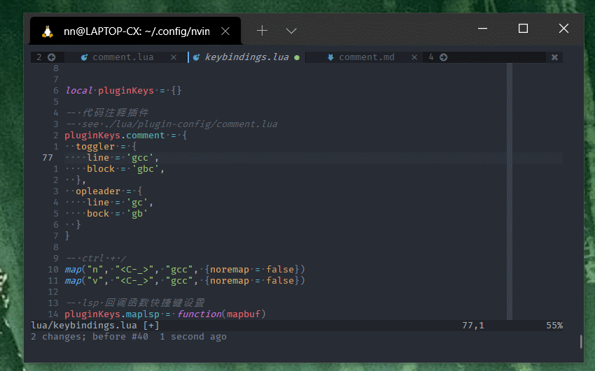

## Neovim 代码注释插件 Comment.nvim 的安装与配置

本章介绍如何给 Neovim 增加代码注释快捷。

## 安装 [Comment.nvim](https://github.com/numToStr/Comment.nvim) 插件

打开 `plugins.lua` ，增加 `Comment.nvim` 相关的代码。

```lua
  -- Comment
  use 'numToStr/Comment.nvim'
```

`:wq` 保存退出，重新打开后运行 `:PackerSync` 安装插件。

`Packer.nvim` 使用方式参看 [之前章节](../packer-usage.md)

成功后如图所示，按 q 退出。

如果报错网络错误，重新运行 `:PackerSync`

## 配置 Comment.nvim

创建 `lua/plugin-config/comment.lua` 文件，增加：

```lua
require('Comment').setup(require('keybindings').comment)
```

由于注释只需要配置快捷键触发就可以，所以直接调用 `keybindings.lua` 里设置的快捷键

打开 `lua/keybindings.lua`，添加

```lua
-- 代码注释插件
pluginKeys.comment = {
  toggler = {
    line = 'gcc',
    block = 'gbc',
  },
  opleader = {
    line = 'gc',
    bock = 'gb'
  }
}

-- ctrl + /
map("n", "<C-_>", "gcc", {noremap = false})
map("v", "<C-_>", "gcc", {noremap = false})
```

这个插件也是很强大的，可去主页研究，我目前只用到基本的功能。

在 Normal 模式下

- `gcc` - 行注释切换
- `gbc` - 块注释切换
- `gc[count]{motion}` - 例如 `gc3j` 注释下边三行
- `gb[count]{motion}` - 例如 `gbi{` 把 `{}` 中的内容注释

`gc` `gb` 很强大，`gc` 可以记为`go comment`， `gb` 可以记为 `go block comment`

和其他动词一样，可以接[count]{motion}，比如 `gci(` 或 `gbi(` 把 `()` 中的内容注释，这个非常方便呀


`gci{`  和 `gbi{`



VISUAL 模式下

- `gc` - 切换行注释
- `gb` - 切换块注释

当然为了保留我在 `VSCode` 下的习惯，设置了 `Ctrl + /` 为切换注释，

注意 Vim 下 `Ctrl + /` 要写成 `<C-_>`，应该也是历史遗留问题吧

```lua
-- ctrl + /
map("n", "<C-_>", "gcc", {noremap = false})
map("v", "<C-_>", "gcc", {noremap = false})
```

完整文件 [keybindings.lua](https://github.com/nshen/learn-neovim-lua/blob/main/lua/keybindings.lua) 文件

- 下一章编写中
- [回首页](../../README.md)

