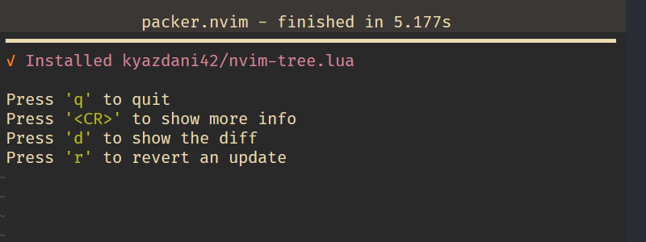
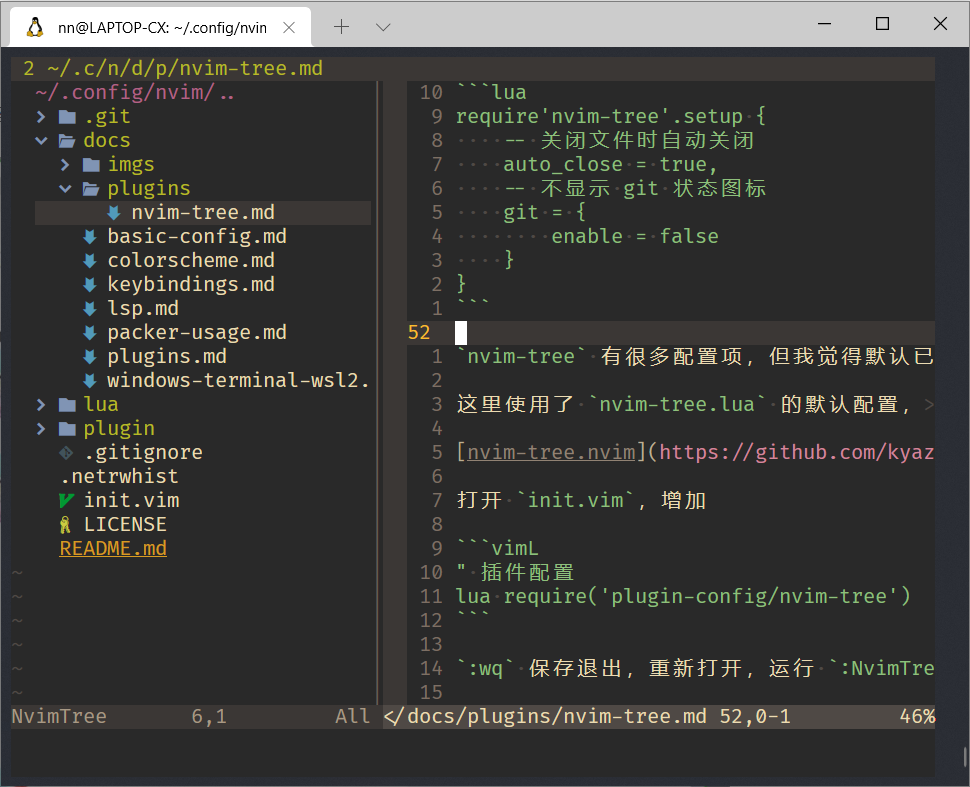
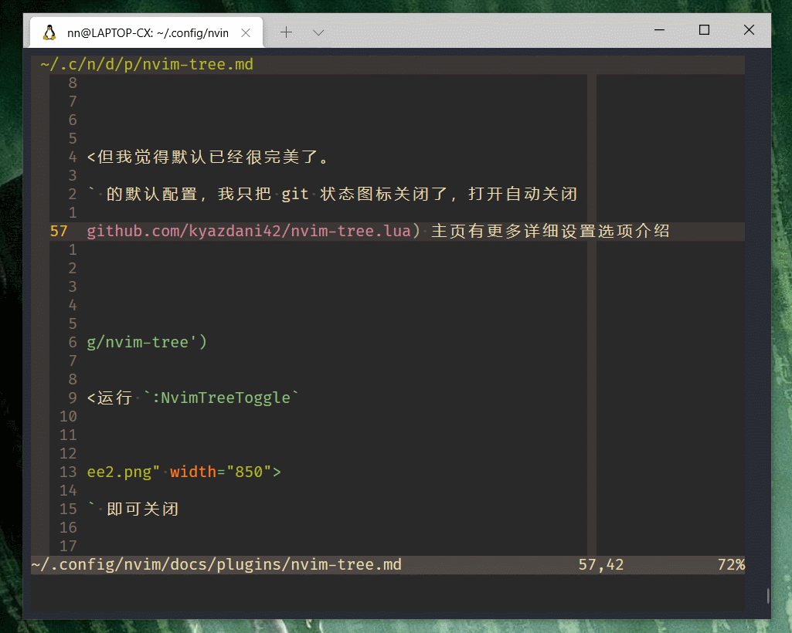
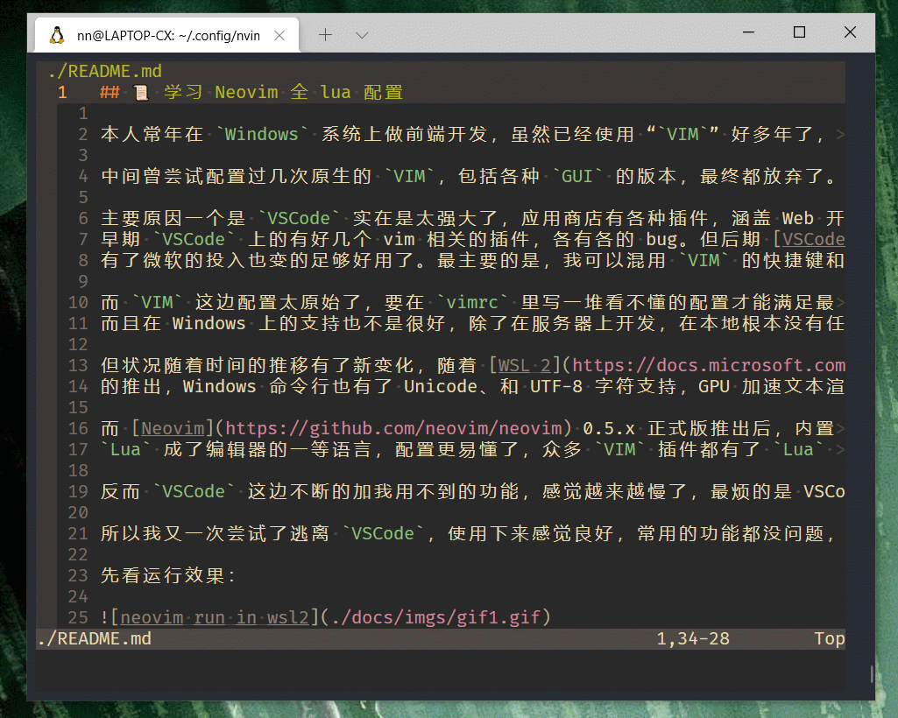

## Neovim 插件 nvim-tree 的安装与配置

本章介绍如何给 nvim 安装和配置 [nvim-tree.lua](https://github.com/kyazdani42/nvim-tree.lua) 插件。

## 安装 nvim-tree

打开 `plugins.lua` ，增加 `nvim-tree` 相关的代码

```lua
return require('packer').startup(function()
    -- Packer can manage itself
    use 'wbthomason/packer.nvim'
    -- gruvbox theme
    use {
        "ellisonleao/gruvbox.nvim",
        requires = {"rktjmp/lush.nvim"}
    }
    -- nvim-tree (新增)
    use {
        'kyazdani42/nvim-tree.lua',
        requires = 'kyazdani42/nvim-web-devicons'
    }
end)
```

`:wq` 保存退出，重新打开后运行 `:PackerSync`

`Packer.nvim` 使用方式参看 [之前章节](../packer-usage.md)

成功后如图所示，按 q 退出



如果报错网络错误，重新运行 `:PackerSync`

## 配置 nvim-tree

创建 `lua/plugin-config/nvim-tree.lua` 文件

添加配置

```lua
require'nvim-tree'.setup {
    -- 不显示 git 状态图标
    git = {
        enable = false
    }
}
```

`nvim-tree` 有很多配置项，但我觉得默认已经很完美了。

这里使用了 `nvim-tree.lua` 的默认配置，我只把 git 状态图标关闭了

[nvim-tree.nvim](https://github.com/kyazdani42/nvim-tree.lua) 主页有更多详细设置选项介绍

打开 `init.vim`，增加

```vimL
" 插件配置
lua require('plugin-config/nvim-tree')
```

`:wq` 保存退出，重新打开，运行 `:NvimTreeToggle`

如图：



再次运行 `:NvimTreeToggle` 即可关闭

## 配置快捷键

打开 `/lua/keybindings.lua` 增加

```lua
-- nvimTree
map('n', '<A-m>', ':NvimTreeToggle<CR>', opt)
```

我习惯 `Alt + m` 打开、关闭菜单， `Alt + hjkl` 窗口间切换窗口



## 文件操作

`nvim-tree` 可以执行常见的 创建 、删除、拷贝、剪切 文件等操作

- `o` 打开关闭文件夹
- `a` 创建文件
- `r` 重命名
- `x` 剪切
- `c` 拷贝
- `p` 粘贴
- `d` 删除

下边 `gif` 演示常见操作

`alt+m` 打开菜单 -> `a` 创建文件 -> `o` 打开文件夹 -> `r` 重命名为 -> `c` 拷贝 -> `p` 粘贴 -> `d` 删除文件



还有其他功能，我不常用，详见 [nvim-tree.nvim](https://github.com/kyazdani42/nvim-tree.lua) 主页

下一章介绍 `bufferline.nvim` 插件，感谢关注。

- 下一章： [Neovim 插件 bufferline 的安装与配置](./bufferline.md)
- [回首页](../../README.md)
