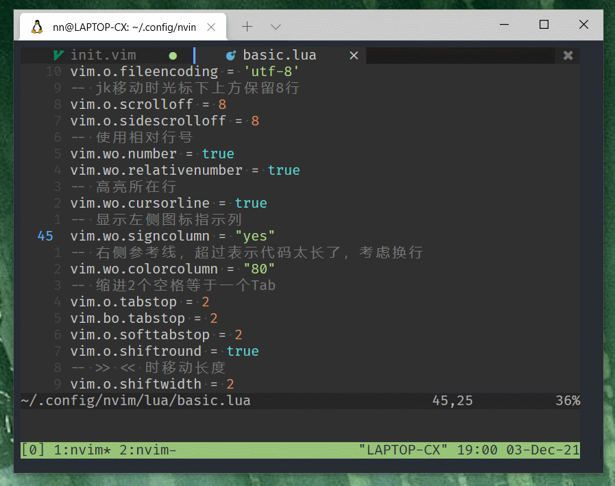
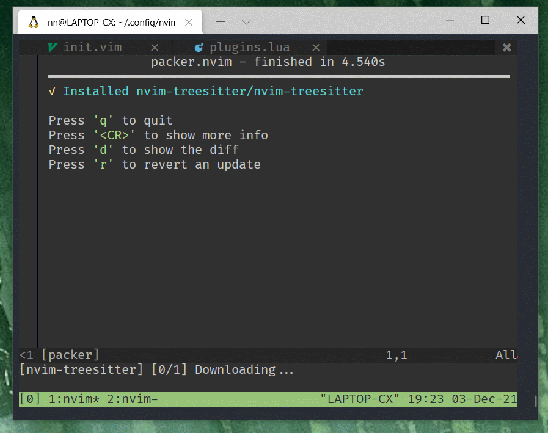
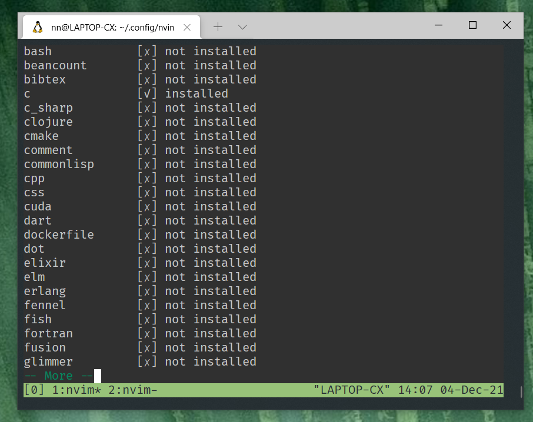
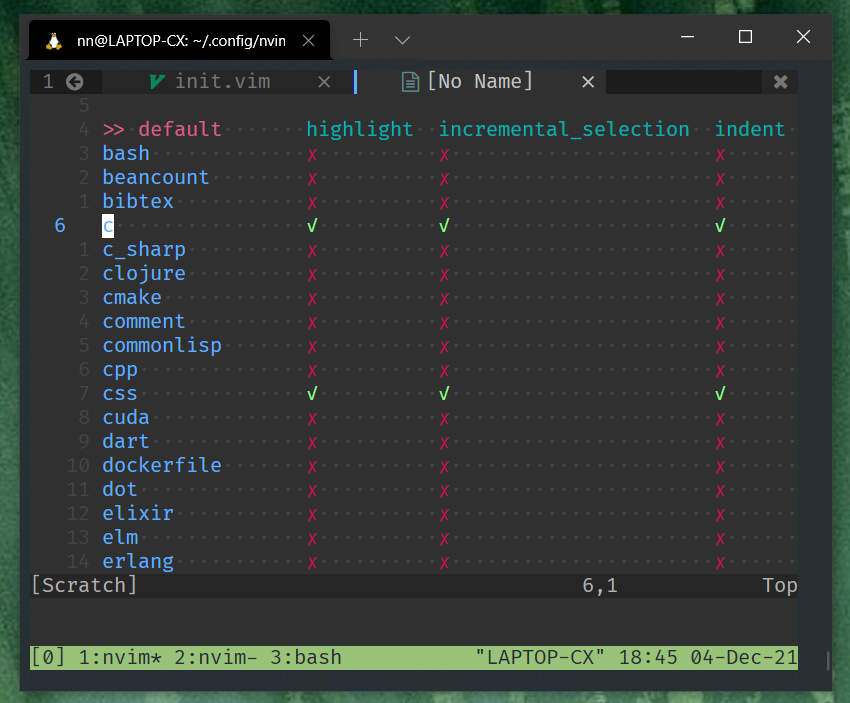
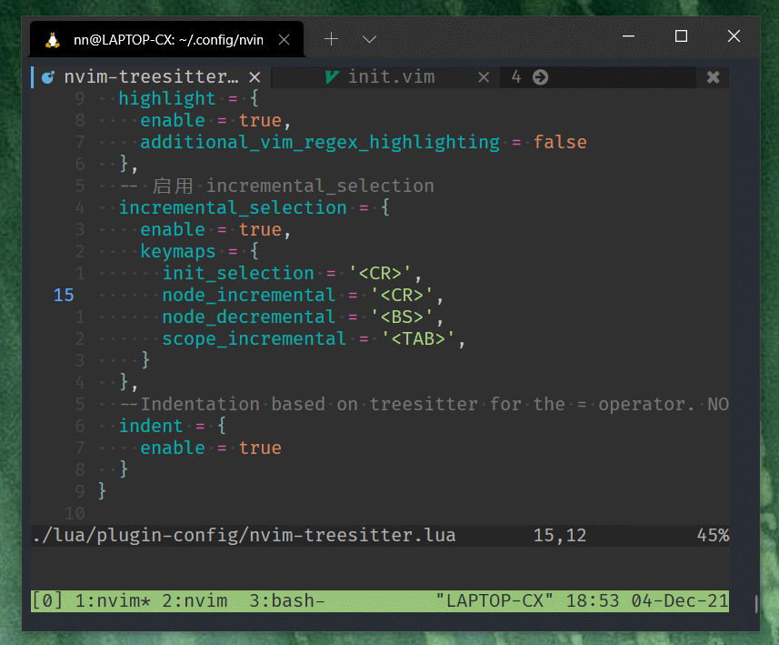
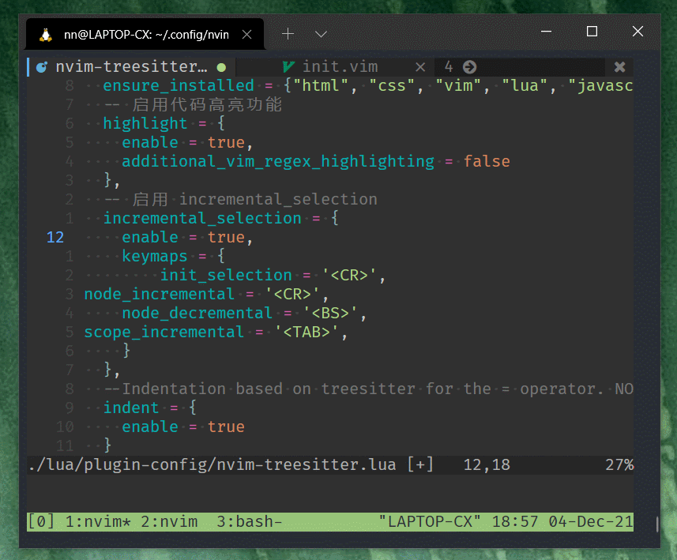
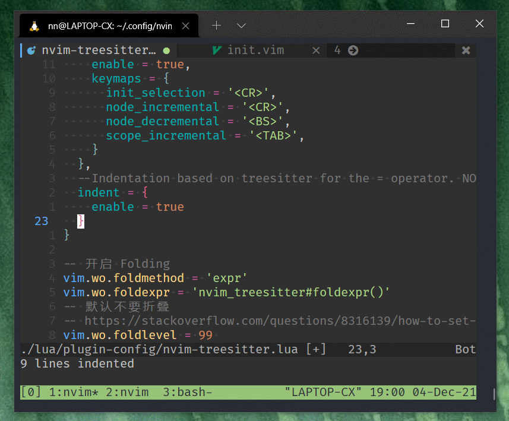

## Neovim 代码高亮插件 nvim-treesitter 的安装与配置

本章介绍如何给 nvim 安装和配置 [nvim-treesitter](https://github.com/nvim-treesitter/nvim-treesitter) 插件。

`nvim-treesitter` 插件提供基于 `tree-sitter` 的多个基础功能，它可以让你在 nvim 中高效的实现 **代码高亮**，**增量选择** 等功能。

先看一下之前的 `basic.lua` 安装前和安装后代码高亮效果对比：



之所以效果这么好，是因为 `Treesitter` 可以针对不同的语言，安装不同的 `language parser`, 根据需要下载。

不同语言的效果截图详见官网 [Gallery](https://github.com/nvim-treesitter/nvim-treesitter/wiki/Gallery)。

`nvim-treesitter` 支持的编程语言非常多，常见都支持，列表见 [Supported languages](https://github.com/nvim-treesitter/nvim-treesitter#supported-languages)。

## 安装 nvim-treesitter

打开 `plugins.lua` ，增加 `nvim-treesitter` 相关的代码

```lua
  -- treesitter
  use { 'nvim-treesitter/nvim-treesitter', run = ':TSUpdate' }
```

完整 `plugins.lua` 文件如下：

```lua
return require('packer').startup(function()
    -- Packer can manage itself
    use 'wbthomason/packer.nvim'
    ----------- colorscheme -----------
    -- gruvbox
    use {"ellisonleao/gruvbox.nvim", requires = {"rktjmp/lush.nvim"}}
    -- zephyr
    use 'glepnir/zephyr-nvim'
    --  nord
    use 'shaunsingh/nord.nvim'
    ----------------------------------
    -- nvim-tree
    use {
        'kyazdani42/nvim-tree.lua',
        requires = 'kyazdani42/nvim-web-devicons'
    }
    -- bufferline
    use {'akinsho/bufferline.nvim', requires = 'kyazdani42/nvim-web-devicons'}

    -- treesitter (新增)
    use { 'nvim-treesitter/nvim-treesitter', run = ':TSUpdate' }
end)

```

`:wq` 保存退出，重新打开后运行 `:PackerSync`

`Packer.nvim` 使用方式参看 [之前章节](../packer-usage.md)

注意下边状态栏，安装后会默认下载一个 `c` 的 `parser` ，如下动图，等待完成， 按 q 退出。



如果报网络错误，重新运行 `:PackerSync`

## 查看已安装的 Language parser

`:TSInstallInfo`



## 手动安装 Language parser

手动安装 language parser

```
:TSInstall <language_to_install>
```

比如

```
:TSInstall javascript
```

安装后调用 `:TSBufToggle highlight` 可显示高亮

其实 **不必手动安装** ，我们可以在配置文件中指定，自动安装

## 配置 nvim-treesitter

`nvim-treesitter` 目前提供以下模块，默认都是关闭的，需要在配置文件中设置 `enable = true` 手动开启

- 代码高亮模块
- 增量选择模块
- `=` 代码格式化模块
- Folding 模块

我配置文件中开启了全部 4 个模块，下边会逐个解释

创建 `lua/plugin-config/nvim-treesitter.lua` 文件

添加配置

```lua
require'nvim-treesitter.configs'.setup {
  -- 安装 language parser
  -- :TSInstallInfo 命令查看支持的语言
  ensure_installed = {"html", "css", "vim", "lua", "javascript", "typescript", "tsx"},
  -- 启用代码高亮功能
  highlight = {
    enable = true,
    additional_vim_regex_highlighting = false
  },
  -- 启用增量选择
  incremental_selection = {
    enable = true,
    keymaps = {
      init_selection = '<CR>',
      node_incremental = '<CR>',
      node_decremental = '<BS>',
      scope_incremental = '<TAB>',
    }
  },
  -- 启用基于Treesitter的代码格式化(=) . NOTE: This is an experimental feature.
  indent = {
    enable = true
  }
}
-- 开启 Folding
vim.wo.foldmethod = 'expr'
vim.wo.foldexpr = 'nvim_treesitter#foldexpr()'
-- 默认不要折叠
-- https://stackoverflow.com/questions/8316139/how-to-set-the-default-to-unfolded-when-you-open-a-file
vim.wo.foldlevel = 99
```

上边我设置了确保安装这些语言，你可以根据你的情况修改

`ensure_installed = {"html", "css", "vim", "lua", "javascript", "typescript", "tsx"}`

查看安装情况，和支持语言运行：

`:TSInstallInfo`

加载配置文件：

打开 `init.vim`，加载 `lua/plugin-config/nvim-treesitter.lua` 配置文件，增加

```vimL
lua require('plugin-config/nvim-treesitter')
```

`:wq` 保存退出，重开后应该会自动安装语言，安装后运行 `:TSModuleInfo` 查看是否成功



都打对号就成功了。

## 代码高亮模块

代码高亮如文章开头介绍，成功开启后，效果如下


## 增量选择模块

什么是增量选择 (incremental selection)，见图：



回去看我上边的配置，我把 **回车** 和 **退格** 设置成了快捷键

不断的按 `Enter` 选择区域会从里层不断外扩， `Backspace` 则相反不断内收。

## `=` 代码格式化(indent) 模块

用 `=` 格式化代码， 如图



`gg=G` 命令格式化整个文件， 相当于 `ggvG=` 选中整个文件然后 `=` 格式化

可以考虑添加一个快捷键，编辑 `lua/keybindings.lua`

```lua
-- nvim-treesitter 代码格式化
map("n", "<leader>i", "gg=G", opt)
```

## Folding 模块

`zc`， `zo` 会 折叠 `{}` 里的内容，如图



下一章继续介绍其他插件，感谢关注。

- 下一章： (正在写)
- [回首页](../../README.md)
