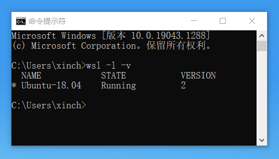
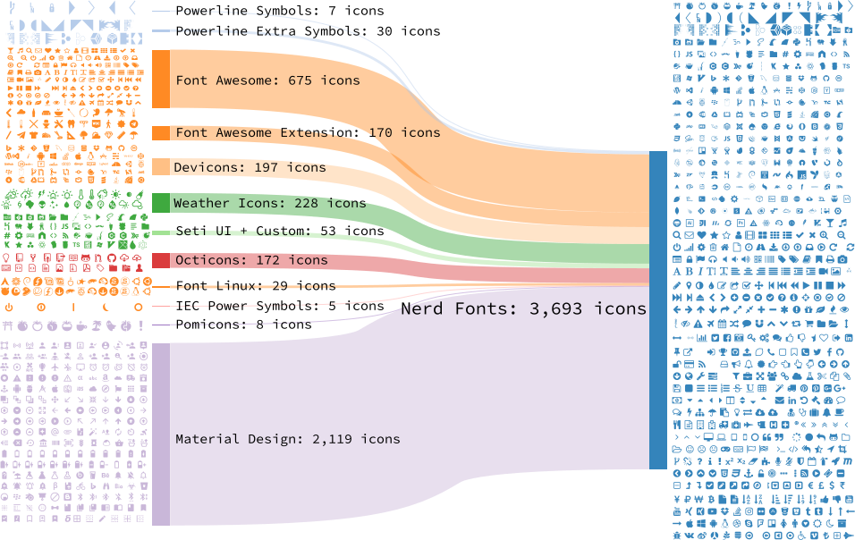
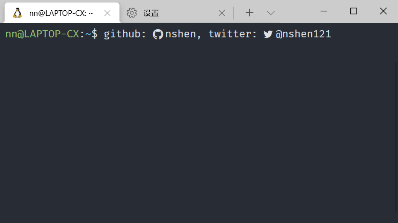

## 在 Windows Terminal 与 WSL 2 下安装 Neovim 

本章介绍如何在 `Windows` 命令行环境下安装 `Neovim`

## WSL 2 

首先确定你的 `Windows` 系统是否为 `WSL 2`，如果不是请先 *找教程* 升级到 `WSL 2`。

查看方法为在 `cmd` 中运行 `wls -l -v`



可以看到我安装的子系统为 `Ubuntu-18.04`，也是我推荐的系统。

后边的 `VERSION` 2 表示是在 `WSL2` 环境，成功后继续下一步。

## Windows Terminal

在 [微软应用商店](https://www.microsoft.com/en-us/p/windows-terminal/9n0dx20hk701?activetab=pivot:overviewtab#) 直接点击 GET 安装


安装后可以在 `设置` 里进行一系列美化设置，之后最重要的是安装 `Nerd fonts`。

## Nerd fonts

简单讲，Nerd fonts 就是打包了各种常见的 ‘iconic fonts’，到你常用的字体里。

这样就可以方便的在命令行下显示这些 icons 了。 很多 `Neovim` 插件都会用到这些图标



到这里 https://www.nerdfonts.com/font-downloads 找到你喜欢的字体。

比如我在 `VSCode` 里最常用的是 `Fira Code` 字体，那么我就安装这个打了 Patch 的`FiraCode` 字体

https://github.com/ryanoasis/nerd-fonts/tree/master/patched-fonts/FiraCode/Regular/complete/

注意要下载兼容 `Windows` 的版本 `XXXX Windows Compatible.ttf`，下载后双击即可安装完成。

到 `Terminal` 中点击 `设置` `外观`，在字体选项里，选中刚才安装的字体，保存。


安装过后，命令行里就支持显示这些小图标了，为了测试是否成功，可以到这个网址可以复制小图标

https://www.nerdfonts.com/cheat-sheet

粘贴到命令行里。



看到我的 `github` 和 `twitter` 小图标了吗，这样就是成功了。

## 安装 Neovim

由于我的环境的 `Ubuntu-18.04` ，所以要用 `apt` 安装 `Neovim`，具体方法如下：

```bash
sudo add-apt-repository ppa:neovim-ppa/stable
sudo apt-get update
sudo apt-get install neovim
```

如果报错找不到 `add-apt-repository` 命令，需要先安装下边的包

```bash
sudo apt-get install software-properties-common
```

安装成功后，运行 `nvim` 即可打开，注意确认 `nvim` 版本必须为 **0.5** 以上，如果版本过低，说明没有成功添加 `ppa:neovim-ppa/stable`

需要重新安装，当然你也可以选择安装 `unstable` 版本

`sudo add-apt-repository ppa:neovim-ppa/unstable`

安装后可选步骤，替换默认的vim  `nvim ~/.bashrc`

```bash
alias vim='nvim'
alias vi='nvim'
alias v='nvim'
```

目前安装完成，但 `vim` 的默认配置不尽人意，下一篇介绍基础配置。

- 下一章： [Neovim 基础配置](./basic-config.md)  
- [回首页](../README.md)
